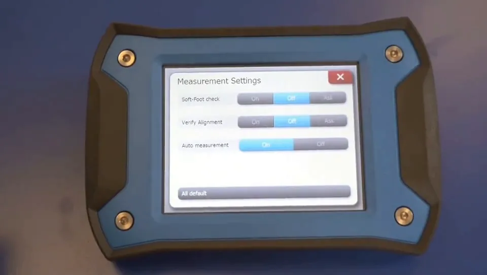

# seamless-ai-dub

Dubs an English video into Brazilian Portuguese, keeping each translated line
inside the time window of the sentence it replaces.

[Case study](https://luantaraschi.dev/en/projeto-dub.html)



## Overview

Drop in an MP4 and get back the same video with a Portuguese voice track.
Transcription, translation, speech synthesis and remixing run as one pipeline;
the only required credential is an OpenRouter key.

The hard part of dubbing is not the translation. It is that Portuguese takes
longer to say than English. A sentence that fits in 3.4 seconds of English
routinely needs 4.2 seconds in Portuguese, and if you simply drop the
generated audio at the original timestamp, every line runs into the next one
and the whole track slides out of sync with the speaker's mouth. Everything
interesting in this project is about that gap.

## Architecture

```
video.mp4
   |
MoviePy .......... extract audio track
   |
Whisper (medium) . transcribe to timestamped segments
   |
   |  for each segment:
   |     OpenRouter ......... translate EN -> PT, one segment at a time
   |     Edge-TTS ........... synthesize PT audio  (ElevenLabs if configured)
   |     pydub .............. measure it, compress to fit if too long
   |     position at the original segment's start time
   |
MoviePy .......... duck original audio to 15%, composite, render H.264 + AAC
   |
video_DUBLADO.mp4
```

`dublador.py` is the pipeline. `app.py` wraps it in a Gradio interface for
uploading a file, entering keys and watching the log.

## Engineering Highlights

### Fitting the translation into the original's time window

Each segment is synthesized, then measured. When the Portuguese audio is
longer than the English it replaces, it is compressed to fit rather than
allowed to overrun.

The naive way to do that is to raise the playback rate, which raises the pitch
with it and turns the narrator into a chipmunk. `acelerar_audio_sem_esquilo`
uses pydub's `speedup`, which shortens the waveform while leaving the
frequency content alone, with a 150ms chunk size and a 25ms crossfade so the
joins between chunks are not audible.

Compression is capped at 1.45x. Past that, intelligibility goes before sync
does, so a stubborn segment is allowed to overrun slightly instead of being
squeezed into something breathless. Segments already short enough are left
untouched at their natural pace rather than being stretched to fill the gap.

### Segment by segment translation, not whole transcript translation

Translation happens one Whisper segment at a time, so the returned text is
bound to the timestamps it has to fit. Handing the model the full transcript
would produce better prose and destroy the alignment, since there would be no
reliable way to map the result back onto the segment boundaries. This is a
deliberate trade of translation quality for synchronization.

### A synthesis chain that degrades instead of failing

ElevenLabs is optional and better; Edge-TTS is free and always available. The
synthesis function falls back rather than raising, in three separate cases:
`USAR_ELEVENLABS` is off, it is on but the key or voice id is missing, or the
request came back with a non 200 status. Each case logs which path it took and
then continues on `pt-BR-AntonioNeural`. A dropped API call costs you voice
quality on that line, not the render you have been waiting on.

### The original audio stays in, quietly

The English track is not removed. It is ducked to 15% and composited under the
Portuguese, which keeps the room tone, the music and the timing cues of the
original instead of leaving silence wherever nobody is speaking. It also makes
a desynchronized line audible immediately during review.

Intermediate files are cleaned up per segment after the render, with the
deletion guarded so a missing temp file cannot fail the job at the finish
line.

## Tech Stack

| Layer | Choice | Role in this project |
|---|---|---|
| Transcription | openai-whisper, `medium` | Segments with start and end timestamps |
| Translation | OpenRouter | One request per segment |
| Speech | edge-tts, ElevenLabs optional | Portuguese voice synthesis |
| Audio | pydub | Duration measurement, pitch safe compression |
| Video | MoviePy, FFmpeg | Extraction, compositing, H.264 + AAC render |
| Interface | Gradio | Upload, credentials, live log |

## Testing & Reliability

There is no automated test suite and no CI in this repository. Output is
judged by watching the result, which is genuinely how you evaluate dubbing,
but it does leave the deterministic parts unverified. The one function that
should be tested in isolation is the fit calculation, since the speed factor
and its 1.45x ceiling are pure arithmetic over two durations.

Runtime failure handling is real, though narrow: a missing `OPENROUTER_API_KEY`
raises immediately instead of failing after transcription, ElevenLabs failures
fall back as described above, and segments shorter than two characters are
skipped rather than sent for translation.

## Running Locally

Requires Python 3.10+ and FFmpeg on the system PATH. The first run downloads
the Whisper `medium` weights, roughly 1.5 GB.

```bash
python -m venv .venv
.venv\Scripts\activate
pip install -r requirements.txt
```

Copy `.env.example` to `.env` and set your key:

```
OPENROUTER_API_KEY=...
```

Then launch the interface:

```bash
python app.py
```

`python dublador.py` runs the same pipeline headless against the file named in
`ARQUIVO_VIDEO`.

## Known Limitations

- One language pair, English to Portuguese, hardcoded along with the voice.
- One voice for every speaker. There is no diarization, so a conversation
  between two people is dubbed by the same narrator.
- Whisper `medium` on CPU is slow. Processing time is a multiple of the
  video's length.
- Long segments that need more than 1.45x compression will overrun into the
  next line.

## License

MIT. See [`LICENSE`](LICENSE).
